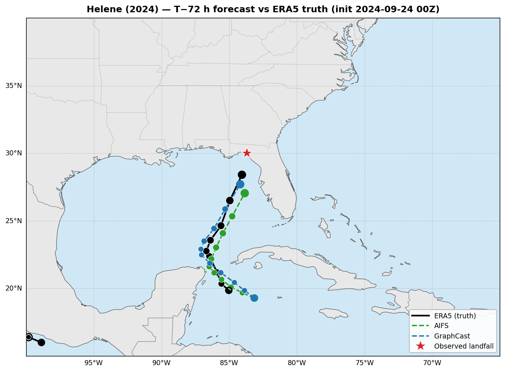
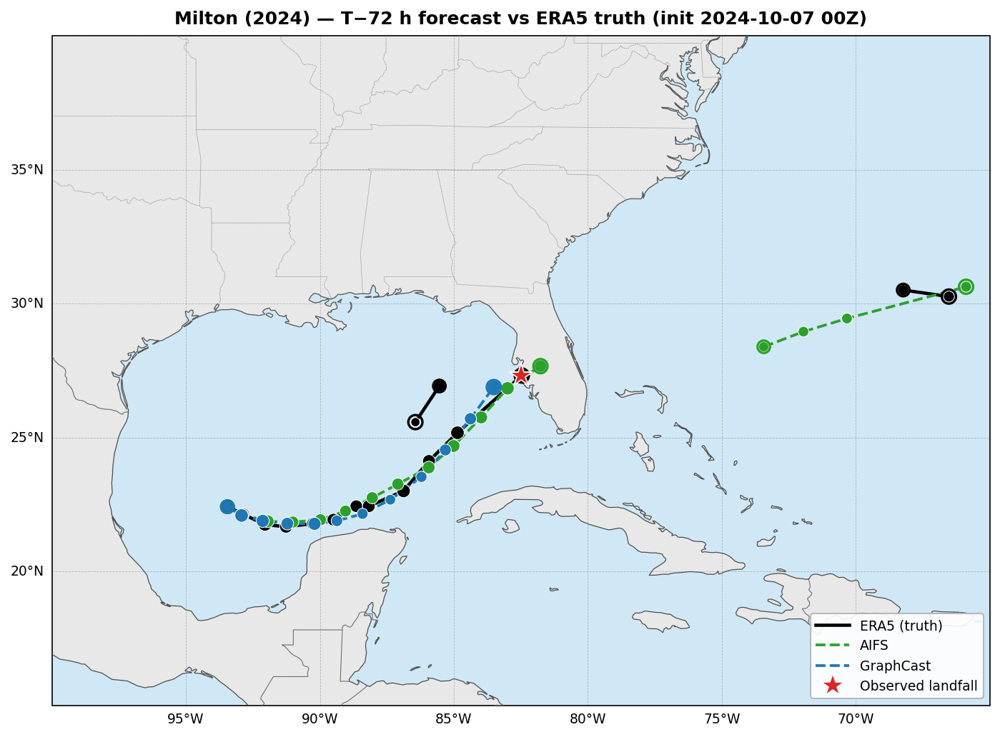
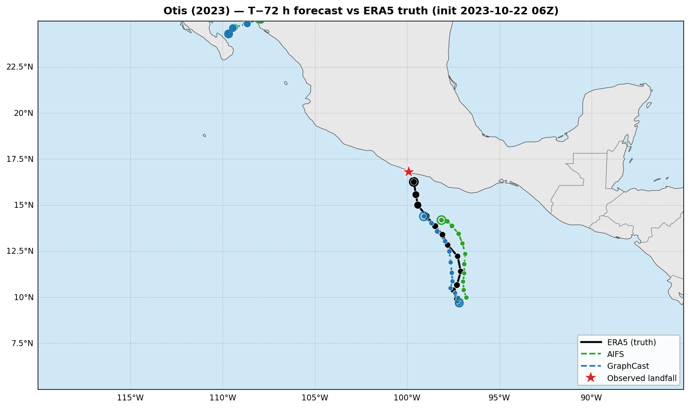

# Hurricane Forecast Comparison

Comparing AI weather model tropical cyclone track forecasts against ERA5 reanalysis for three major hurricanes using [NVIDIA earth2studio](https://github.com/NVIDIA/earth2studio).

## Models

- **AIFS** (ECMWF Artificial Intelligence Forecasting System) -- global ML weather model
- **GraphCast** (Google DeepMind) -- graph neural network weather model
- **ERA5** -- ECMWF reanalysis used as ground truth

Each storm is evaluated at three lead times: 72h, 168h, and 240h. Tracks are extracted using the Wu-Duan tropical cyclone tracker.

## Storms

### Hurricane Helene (2024)

Category 4 hurricane that made landfall in the Florida Big Bend region on September 27, 2024.



### Hurricane Milton (2024)

Category 5 hurricane that struck Florida's Gulf Coast on October 9, 2024.



### Hurricane Otis (2023)

Category 5 hurricane that underwent rapid intensification before making landfall near Acapulco, Mexico on October 25, 2023.



## Setup

Requires Python 3.12 and a CUDA-capable GPU with ~44 GB VRAM.

```bash
uv sync
./apply_patches.sh
```

The patch script fixes two known issues in installed packages:
1. NVRTC compilation error with CUDA 13 fp8 headers in cupy
2. xarray Dataset compatibility in earth2studio's GraphCast wrapper

## Running

Open the notebooks in JupyterLab using the `hurricane-forecasts` kernel and run all cells. Each notebook takes approximately 30-60 minutes depending on CDS/ARCO data download speeds and GPU performance.

- `helene_forecast_comparison.ipynb`
- `milton_forecast_comparison.ipynb`
- `otis_forecast_comparison.ipynb`

